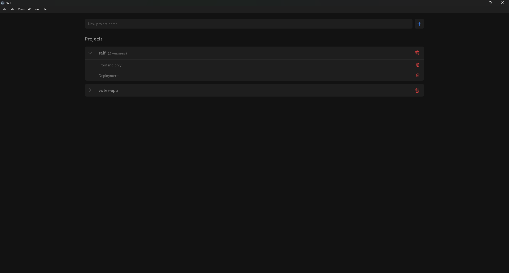
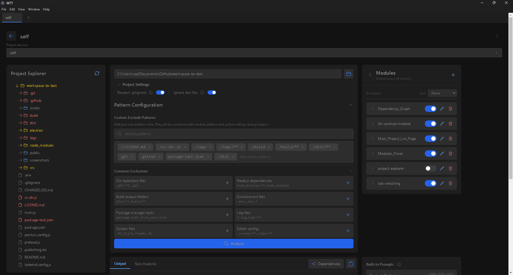
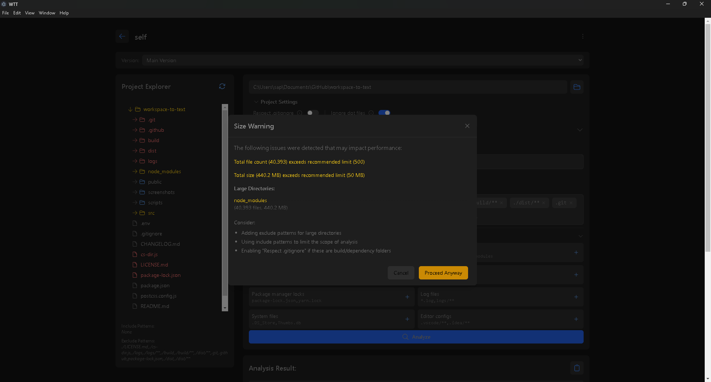

# Workspace to Text (WTT)

A desktop application that converts your project workspace into formatted text output, ideal for documentation, analysis, or AI model input. WTT provides intelligent file filtering, project versioning, and a visual file explorer to help you manage and analyze your codebase.

## 📸 Screenshots

### Main Projects Page


### Project Explorer and Analysis


### Size Warning Dialog


## ✨ Features

- 🗂️ **Project Management**
  - Create and manage multiple projects
  - Version control for projects with named snapshots
  - Project-specific settings and configurations

- 📁 **File Explorer**
  - Interactive file tree visualization
  - Real-time directory scanning
  - Context menu for quick actions
  - Visual indicators for excluded files/folders

- 🔍 **Smart Filtering**
  - Pattern-based file inclusion/exclusion
  - Built-in common exclusion patterns
  - `.gitignore` integration
  - Dot-files handling

- 📊 **File Analysis**
  - File size visualization and metrics
  - Size limit warnings for large projects
  - Comprehensive file type detection (100+ formats)
  - Directory size analysis

- ⚡ **Performance & Safety**
  - Intelligent memory usage optimization
  - Tabbed interface for output and analysis
  - Better handling of large codebases

## 🚀 Getting Started

### Installation

#### Windows
- Download the installer (WTT-Setup-x.x.x.exe) from the [releases page](https://github.com/sapn1s/workspace-to-text/releases)
- Run the installer and follow the prompts
- Alternatively, download the portable version if you prefer not to install

#### Development Setup
```bash
# Clone the repository
git clone https://github.com/sapn1s/workspace-to-text.git

# Install dependencies
npm install

# Start development
npm start

# Build for production
npm run electron-build
```

## 💡 Usage

1. **Create a Project**
   - Click the "New project" input field
   - Enter a project name
   - Press Enter or click the plus icon

2. **Configure Project**
   - Select your project folder
   - Configure project settings:
     - Respect `.gitignore`
     - Ignore dot files
   - Set include/exclude patterns

3. **Pattern Configuration**
   Include specific files:
   ```
   src/**/*.js
   *.tsx
   components/*.jsx
   ```
   
   Exclude directories/files:
   ```
   node_modules
   .git
   dist
   ```

4. **Version Management**
   - Create versions to track different states
   - Switch between versions
   - Each version maintains its own settings

5. **Analysis**
   - Click "Analyze" to process your workspace
   - Review size warnings if applicable
   - Switch between output text and size analysis tabs
   - Copy output to clipboard
   - Pass the output to LLM or whatever is your usecase

### File Types
The application automatically detects and processes over 100 text file types including:
- Source code (.js, .jsx, .ts, .tsx, etc.)
- Configuration files (.json, .yml, .env, etc.)
- Documentation (.md, .txt)
- Web files (.html, .css, .svg)
- Game development files (.gd, .tscn, .unity)
- And many more specialized formats

## 📄 License

This software is dual-licensed:

1. For Non-Commercial Use: [Creative Commons Attribution-NonCommercial 4.0 International](http://creativecommons.org/licenses/by-nc/4.0/)
2. For Commercial Use: All rights reserved. Contact sapn1s for licensing.